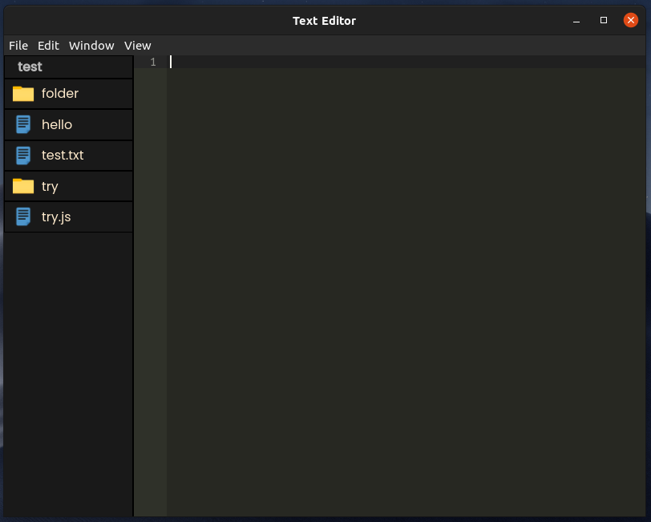

<h1> Simple Text Editor using Electron.js</h1>

## Functions: 
* Open File
* Open Folder
* Edit File
* Save File
* Create New File
* Create New Folder
* Get location of files and folders

## Packages:
* Electron.js
* Node-fs
* Node-path
* Ace.js