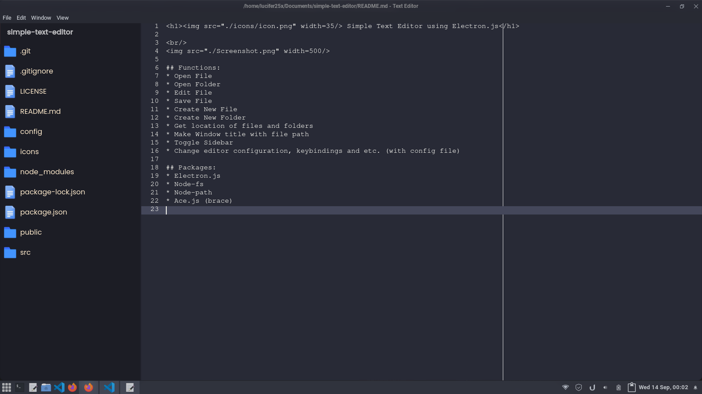

<h1> Ceres Text Editor</h1>

 

## Functions: 
* Open File
* Open Folder
* Edit File
* Save File
* Create New File
* Create New Folder
* Get location of files and folders
* Make Window title with file path
* Toggle Sidebar
* Change editor configuration, keybindings and etc. (with config file)

## Config file locations:
| You can copy default config files from github repository
* Ui: `$HOME/.config/ceres/ui.json`
* Keybindings: `$HOME/.config/ceres/keybindings.json`

### Expected features:
* Highlight, snippets and etc.
* Custom editor themes
* Extensions
* Tabs